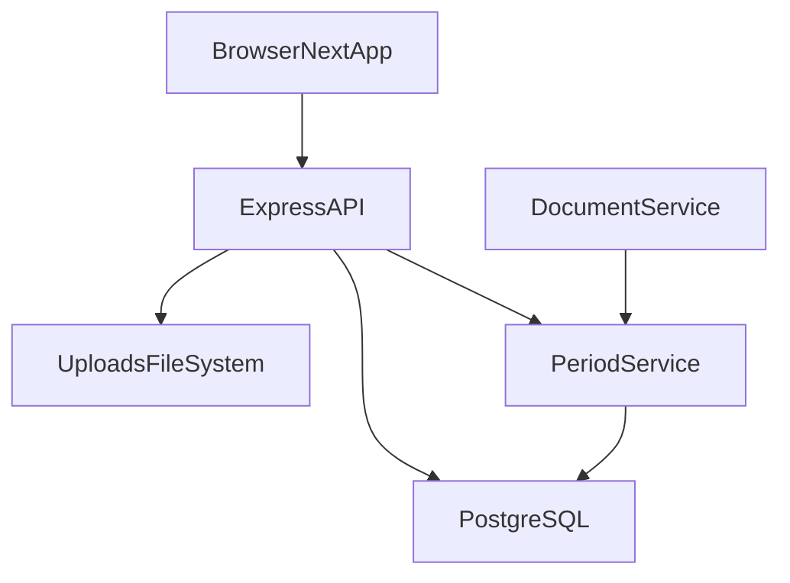

# 02 - Architecture

## Arquitectura general

SISSEP usa arquitectura cliente-servidor con frontend separado del backend y PostgreSQL como persistencia.

## Capas del backend

- Entrada HTTP: `backend/src/server.ts`
- Rutas: `backend/src/routes/*.ts` (`auth`, `documents`, `periods`)
- Controladores: `backend/src/controllers/*.ts`
- Servicios: `backend/src/services/*.ts`
- Persistencia: TypeORM (`models`, `config/database.ts`)
- Utilidades transversales: `utils/*`, `middlewares/*`

## Frontend por segmentos

- Layout raiz y proveedor auth: `frontend/app/layout.tsx`
- Auth: `frontend/app/(auth)/login/page.tsx`, `frontend/app/(auth)/register/page.tsx`
- Dashboard protegido: `frontend/app/dashboard/layout.tsx`
- Redireccion por rol: `frontend/app/dashboard/page.tsx` → `/dashboard/student` o `/dashboard/admin`
- Vistas por rol:
  - Estudiante: `frontend/app/dashboard/(student)/student/page.tsx` (ruta `/dashboard/student`)
  - Encargado: `frontend/app/dashboard/(admin)/admin/page.tsx` (ruta `/dashboard/admin`)

## Flujo de peticion principal

1. Frontend llama API con `frontend/lib/api.ts` (o `uploadFile` / `importStudents` para multipart).
2. Backend recibe en `routes`, valida token/rol en middlewares.
3. Controlador valida entrada y delega al servicio.
4. Servicio consulta/actualiza entidades en PostgreSQL; `document.service` consulta `period.service` para ventanas y bloqueo.
5. Respuesta uniforme via utilidades `ok/fail`.

## Consideraciones de almacenamiento

- Metadata documental en tabla `documents` (incluye `period_number`).
- Periodos de entrega en tabla `delivery_periods`.
- Archivos fisicos en `UPLOAD_BASE` (default `uploads`).
- Ruta relativa de archivo se guarda en DB (`file_path`) para construir URL publica via `/uploads`.
